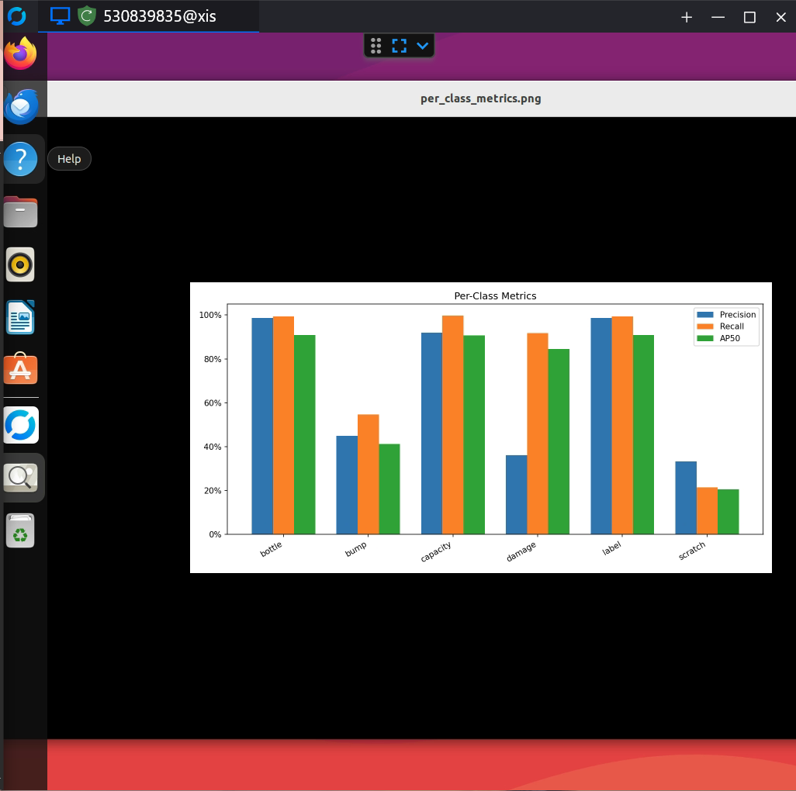
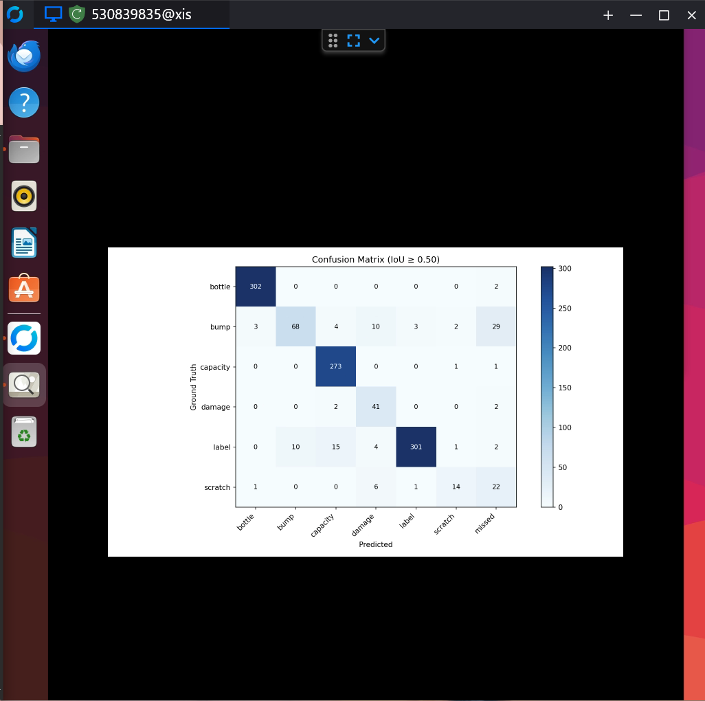

# Frosch RF-DETR Training Report

## 1. Purpose

This document records the RF-DETR models used by the Frosch bottle live-inspection pipeline and the training configuration available from the project materials.

The live inference system uses two separate RF-DETR checkpoints:

1. RF-DETR Medium for object detection.
2. RF-DETR Medium instance segmentation for bottle-mask generation.

The segmentation model supplies the bottle mask used for orientation and mask-based defect validation.

## 2. Models Used by Live Inference

| Model | Class | Checkpoint |
|---|---|---|
| Detection | `RFDETRMedium` | `runs/frosch_medium/checkpoint_best_regular.pth` |
| Segmentation | `RFDETRSegMedium` | `runs/frosch_seg_medium/checkpoint_best_total.pth` |

The current inference script loads the checkpoints independently.

## 3. Detection Model

The detection checkpoint is loaded with:

```python
model = RFDETRMedium(
    pretrain_weights="runs/frosch_medium/checkpoint_best_regular.pth"
)
```

### Runtime confidence configuration

The final inference pipeline uses per-class confidence thresholds:

| Class | Threshold |
|---|---:|
| `bottle` | `0.70` |
| `label` | `0.35` |
| `capacity` | `0.35` |
| `bump` | `0.50` |
| `damage` | `0.30` |
| `scratch` | `0.30` |

The runtime detector classes explicitly used by the inspection logic are:

- `bottle`
- `capacity`
- `label`
- `damage`
- `bump`

### Detection evaluation metrics

The final RF-DETR evaluation artifacts provide per-class precision, recall, F1, AP50, and ground-truth counts. These values are recorded below as reported by the evaluation output.

| Class | Precision | Recall | F1 | AP50 | n_gt |
|---|---:|---:|---:|---:|---:|
| bottle | 0.9869281013499082 | 0.9934210493637465 | 0.9901634311854178 | 0.9090909059011164 | 304 |
| bump | 0.4487179429651546 | 0.5468749914550782 | 0.4929572443964505 | 0.41295822925576553 | 64 |
| capacity | 0.9189189158144632 | 0.9963369926874103 | 0.9560627663495121 | 0.9072138281372374 | 273 |
| damage | 0.360655731792529 | 0.9166666284722238 | 0.5176466413843962 | 0.845539754462985 | 24 |
| label | 0.98688524266595 | 0.9933993366554478 | 0.9901310756960197 | 0.908783780318693 | 303 |
| scratch | 0.3333333148148158 | 0.21428570663265334 | 0.2608690775055942 | 0.20606057535354008 | 28 |

The corresponding per-class plot is stored at:

```text
training_metrics/per_class_metrics.png
```



## 4. RF-DETR Segmentation Training

### Training script

The segmentation training script is designed for the Frosch bottle COCO-segmentation dataset and uses:

```python
from rfdetr import RFDETRSegMedium

model = RFDETRSegMedium()
```

The segmentation model starts from its own segmentation weights and does not load the detection checkpoint.

### Training configuration

The available training configuration is:

| Parameter | Value |
|---|---:|
| Architecture | RF-DETR Medium segmentation |
| Epochs | `50` |
| Batch size | `4` |
| Gradient accumulation | `4` |
| Training resolution | `432` |
| Learning rate | `1e-4` |
| Dataset root | `.` by default |
| Output directory | `runs/frosch_seg_medium` |

Reproducible training command:

```bash
python train_frosch_segmentation.py     --dataset .     --output runs/frosch_seg_medium     --epochs 50     --batch-size 4     --grad-accum-steps 4     --resolution 432     --lr 1e-4
```

## 5. Evaluation Summary and Confusion Matrix

### Metrics summary

The evaluation output contains six evaluated classes: `bottle`, `bump`, `capacity`, `damage`, `label`, and `scratch`. The per-class metrics above are the reported evaluation values; they are not runtime validation counts.

The evaluation shows particularly strong precision/recall/F1 for `bottle`, `capacity`, and `label`, while `bump`, `damage`, and especially `scratch` have lower precision and/or recall. This section reports the measured values without replacing them with estimates or aggregate values that were not present in the supplied evaluation artifact.

### Confusion matrix

The supplied evaluation artifact also includes a confusion matrix at `IoU >= 0.50`. The matrix is reproduced in the image below; rows represent ground truth classes and columns represent predicted classes, including the `missed` column.

```text
training_metrics/confusion_matrix.png
```



The displayed matrix includes the evaluated classes `bottle`, `bump`, `capacity`, `damage`, `label`, and `scratch`, plus `missed`. The matrix should be read together with the per-class precision/recall/AP50 values rather than used as a runtime GOOD/DEFECTIVE classification result.

### Confusion matrix values

The numeric values shown in the supplied confusion-matrix artifact are:

| Ground truth \ Predicted | bottle | bump | capacity | damage | label | scratch | missed |
|---|---:|---:|---:|---:|---:|---:|---:|
| bottle | 302 | 0 | 0 | 0 | 0 | 0 | 2 |
| bump | 3 | 68 | 4 | 10 | 3 | 2 | 29 |
| capacity | 0 | 0 | 273 | 0 | 0 | 1 | 1 |
| damage | 0 | 0 | 2 | 41 | 0 | 0 | 2 |
| label | 0 | 10 | 15 | 4 | 301 | 1 | 2 |
| scratch | 1 | 0 | 0 | 6 | 1 | 14 | 22 |

These values are transcribed directly from the supplied confusion-matrix image. The evaluation artifact's `n_gt` values in the per-class metrics table are retained separately as reported by the evaluation output.

---

## 6. Segmentation Checkpoint Used in Inference

The live script expects:

```text
runs/frosch_seg_medium/checkpoint_best_total.pth
```

and loads it with:

```python
seg_model = RFDETRSegMedium(
    pretrain_weights=SEG_CHECKPOINT
)
```

The runtime segmentation threshold is:

```text
SEG_THRESHOLD = 0.30
```

## 7. How the Segmentation Output Is Used

The segmentation model does not replace the detector.

Instead:

1. RF-DETR detection identifies the bottle bounding box.
2. RF-DETR segmentation provides candidate bottle masks.
3. The best bottle mask is matched to the detector bottle using IoU.
4. The mask is resized to the full camera-frame resolution if required.
5. The mask is constrained to the detector bounding box.
6. Mask pixels are used to calculate bottle orientation.
7. The same bottle mask is used to validate whether damage/bump detections are actually on the bottle.
8. The mask contour is preserved for live and saved annotations.

This keeps tracking and class association detector-based while using segmentation for pixel-level geometry.

## 8. Final Runtime Geometry Configuration

The final inference system uses:

| Parameter | Value |
|---|---:|
| Segmentation threshold | `0.30` |
| Orientation limit | `45°` |
| H centricity threshold | `0.15` |
| 500 ml expected V | `0.01` |
| 100 ml expected V | `0.12` |
| 300 ml expected V | `0.07` |
| V deviation | `0.05` |
| Defect mask overlap | `0.30` |

Centricity stabilization:

```text
CENTRICITY_SPATIAL_TOLERANCE = 0.08
CENTRICITY_MIN_HISTORY = 3
CENTRICITY_HISTORY_WINDOW = 5
MIN_RELIABLE_CENTRICITY_MEASUREMENTS = 3
```

## 9. Runtime and Validation Notes

The final live pipeline has been exercised on recorded runs for:

- 500 ml bottles,
- 300 ml bottles,
- 100 ml bottles.

These runtime counts are validation observations. They are not model-accuracy metrics.

See `RESULTS.md` for the final recorded run counts.

When loading the current checkpoints, RF-DETR runtime warnings have been observed concerning:

- positional encoding differences,
- patch-size differences,
- checkpoint/model class-count configuration,
- missing `num_queries` / `group_detr` checkpoint arguments,
- inference optimization.

These warnings are runtime/environment observations and should not be interpreted as model-quality metrics.


## 10. Relationship to the Inspection Pipeline

```text
Detection checkpoint
    |
    +--> bottle
    +--> capacity
    +--> label
    +--> damage
    +--> bump

Segmentation checkpoint
    |
    +--> bottle mask
            |
            +--> orientation
            |
            +--> H/V centricity
            |
            +--> defect-on-bottle validation
            |
            +--> annotated visualization
```

## 11. Status

The documented training configuration and inference checkpoints are in place.

The final live inspection behavior has been validated across the supported 100 ml, 300 ml, and 500 ml bottle runs.

Formal model metrics remain intentionally separate and should only be added when the corresponding training/evaluation artifacts are available.
