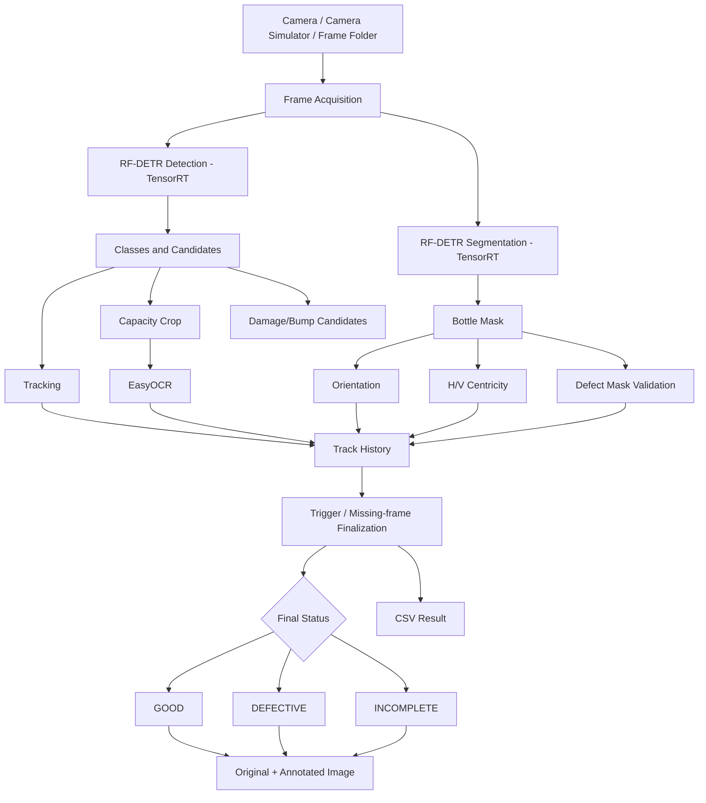

# Frosch Bottle Inspection Pipeline

## Project Overview

The Frosch Bottle Inspection Pipeline is a computer-vision inspection system for Frosch bottles. It combines RF-DETR object detection, RF-DETR instance segmentation, TensorRT inference, EasyOCR capacity recognition, bottle tracking, mask-based geometry checks, defect validation, and structured result/image output.

Final inspection status is one of:

- `GOOD`
- `DEFECTIVE`
- `INCOMPLETE`

The system supports recorded image-folder inference and GenICam/Vimba X camera or camera-simulator acquisition.

## Main Capabilities

- RF-DETR Medium detection
- RF-DETR Medium instance segmentation
- Native TensorRT runtime
- EasyOCR capacity recognition for 100 ml, 300 ml and 500 ml
- Bottle tracking across frames
- Mask-based orientation
- Horizontal and vertical label centricity
- Capacity-specific V-centricity
- Damage/bump validation against bottle masks
- Per-class confidence thresholds
- Temporal/finalization logic
- GOOD / DEFECTIVE / INCOMPLETE classification
- Original and annotated bottle-image retention
- CSV result logging
- OpenCV visualization

## End-to-End Architecture



## Mandatory Handbook Documents

- `README.md`
- `SETUP.md`
- `SYSTEM_ARCHITECTURE.md`
- `DATASET_CARD.md`
- `TRAINING_REPORT.md`
- `MEASUREMENT_REPORT.md`
- `API_MODULE_DOCUMENTATION.md`
- `DESIGN_DECISIONS.md`
- `ASSUMPTIONS_LIMITATIONS.md`

Supporting documents are also included for environment, TensorRT, image saving, validation, simulator use and handoff.

## Model Artifacts

Detection:

```text
runs/frosch_medium/checkpoint_best_regular.pth
output/rfdetr-medium.onnx
output/rfdetr-medium.trt
```

Segmentation:

```text
runs/frosch_seg_medium/checkpoint_best_total.pth
output/rfdetr-seg-medium.onnx
output/rfdetr-seg-medium.trt
```

## Current Bottle Image Storage

```text
saved_bottles/
├── good/
│   ├── original/
│   └── annotated/
├── defective/
│   ├── original/
│   └── annotated/
└── incomplete/
    ├── original/
    └── annotated/
```

CSV handling is separate from the image directory structure.

## End-to-End Validation Reference

| Capacity | Total | GOOD | DEFECTIVE | INCOMPLETE |
|---|---:|---:|---:|---:|
| 100 ml | 13 | 9 | 4 | 0 |
| 300 ml | 10 | 6 | 4 | 0 |
| 500 ml | 29 | 25 | 2 | 2 |
| **Overall** | **52** | **40** | **10** | **2** |

The two 500 ml incomplete cases were physical bottles present at the end of the run that did not reach a complete inspection decision. They are not treated as physical defects.

## Scope Limitation

Camera calibration and calibrated pixel-to-millimetre measurement were not implemented in this project. These deviations from the handbook are explicitly documented rather than represented as completed features.
